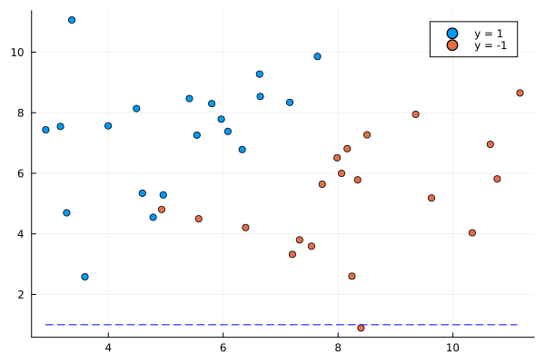

# SVM from scratch in Julia

Repo including explanation and high-level derivation of the SVM method used for classification, see [shilangyu.dev/SVM-from-scratch](https://shilangyu.dev/SVM-from-scratch). Additionally implementations of 3 different SVMs models can be found in Julia files.

## Linear soft margin SVM

